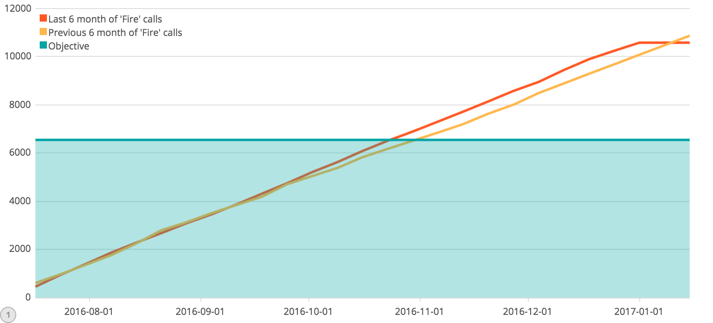

# 911 Calls avec ElasticSearch

## Import du jeu de données

Pour importer le jeu de données, complétez le script `import.js` (ici aussi, cherchez le `TODO` dans le code :wink:).

Exécutez-le ensuite :

```bash
npm install
node import.js
```

Vérifiez que les données ont été importées correctement grâce au shell (le nombre total de documents doit être `153194`) :

```
GET <nom de votre index>/_count
```

## Requêtes

À vous de jouer ! Écrivez les requêtes ElasticSearch permettant de résoudre les problèmes posés.

```
TODO : ajouter les requêtes ElasticSearch ici

Compter le nombre d'appels autour de Lansdale dans un rayon de 500 mètres :
GET 911/_search?size=0
{
    "query": {
        "bool": {
            "must":{
                "match_all": {}
            },
            "filter": {
                "geo_distance": {
                    "distance": 500,
                    "coordonnees": {
                        "lat": 40.241493,
                        "lon": -75.283783
                    }
                }
            }
        }
    }
}
Reponse:
{
  "took" : 1,
  "timed_out" : false,
  "_shards" : {
    "total" : 5,
    "successful" : 5,
    "skipped" : 0,
    "failed" : 0
  },
  "hits" : {
    "total" : 717, //----------------------------------OK
    "max_score" : 0.0,
    "hits" : [ ]
  }
}

Compter le nombre d'appels par catégorie :
GET 911/_search?size=0
{
  "aggs": {
    "EMS": {
      "filter": {
          "query_string": {
            "default_field": "categorie",
            "query": "EMS"
          }
      }
    },
    "Fire":{
      "filter": {
          "query_string": {
            "default_field": "categorie",
            "query": "Fire"
          }
      }
    },
    "Traffic":{
      "filter": {
          "query_string": {
            "default_field": "categorie",
            "query": "Traffic"
          }
        }
    }
  }
}

Réponse :
{
  "took" : 75,
  "timed_out" : false,
  "_shards" : {
    "total" : 5,
    "successful" : 5,
    "skipped" : 0,
    "failed" : 0
  },
  "hits" : {
    "total" : 153194,
    "max_score" : 0.0,
    "hits" : [ ]
  },
  "aggregations" : {
    "Traffic" : {
      "doc_count" : 54549 //----------------------------------OK
    },
    "Fire" : {
      "doc_count" : 23056 //----------------------------------OK
    },
    "EMS" : {
      "doc_count" : 75589 //----------------------------------OK
    }
  }
}

Trouver les 3 mois ayant comptabilisés le plus d'appels :
GET 911/_search?size=0
{
  "aggs": {
    "callsDate": {
      "date_histogram": {
        "field": "dateheure",
        "interval": "month",
        "format": "MM/yyyy", 
        "order": {
          "_count": "desc"
        }
      }
    }
  }
}

Réponse :

{
  "took" : 165,
  "timed_out" : false,
  "_shards" : {
    "total" : 5,
    "successful" : 5,
    "skipped" : 0,
    "failed" : 0
  },
  "hits" : {
    "total" : 153194,
    "max_score" : 0.0,
    "hits" : [ ]
  },
  "aggregations" : {
    "callsDate" : {
      "buckets" : [
        {
          "key_as_string" : "01/2016", //----------------------------------OK
          "key" : 1451606400000,
          "doc_count" : 13096
        },
        {
          "key_as_string" : "10/2016", //----------------------------------OK
          "key" : 1475280000000,
          "doc_count" : 12502
        },
        {
          "key_as_string" : "12/2016", //----------------------------------OK
          "key" : 1480550400000,
          "doc_count" : 12162
        },
        {
          "key_as_string" : "11/2016",
          "key" : 1477958400000,
          "doc_count" : 12091
        },
        {
          "key_as_string" : "07/2016",
          "key" : 1467331200000,
          "doc_count" : 12088
        },
        {
          "key_as_string" : "08/2016",
          "key" : 1470009600000,
          "doc_count" : 11904
        },
        {
          "key_as_string" : "06/2016",
          "key" : 1464739200000,
          "doc_count" : 11732
        },
        {
          "key_as_string" : "09/2016",
          "key" : 1472688000000,
          "doc_count" : 11669
        },
        {
          "key_as_string" : "02/2016",
          "key" : 1454284800000,
          "doc_count" : 11396
        },
        {
          "key_as_string" : "05/2016",
          "key" : 1462060800000,
          "doc_count" : 11374
        },
        {
          "key_as_string" : "04/2016",
          "key" : 1459468800000,
          "doc_count" : 11287
        },
        {
          "key_as_string" : "03/2016",
          "key" : 1456790400000,
          "doc_count" : 11059
        },
        {
          "key_as_string" : "12/2015",
          "key" : 1448928000000,
          "doc_count" : 7916
        },
        {
          "key_as_string" : "01/2017",
          "key" : 1483228800000,
          "doc_count" : 2918
        }
      ]
    }
  }
}


Trouver le top 3 des villes avec le plus d'appels pour overdose : 
GET 911/_search?size=0
{
  "query": {
    "query_string": {
      "default_field": "titre",
      "query": "*OVERDOSE*"
    }
  },
  "aggs": {
    "quartiers": {
      "terms": {
        "field": "quartier.keyword",
        "size": 3,
        "order" : { "_count" : "desc" }
      }
    }
  }
}

Réponse : 
{
  "took" : 43,
  "timed_out" : false,
  "_shards" : {
    "total" : 5,
    "successful" : 5,
    "skipped" : 0,
    "failed" : 0
  },
  "hits" : {
    "total" : 1948,
    "max_score" : 0.0,
    "hits" : [ ]
  },
  "aggregations" : {
    "quartiers" : {
      "doc_count_error_upper_bound" : 43,
      "sum_other_doc_count" : 1455,
      "buckets" : [
        {
          "key" : "POTTSTOWN",
          "doc_count" : 203 //----------------------------------OK
        },
        {
          "key" : "NORRISTOWN",
          "doc_count" : 180 //----------------------------------OK
        },
        {
          "key" : "UPPER MORELAND",
          "doc_count" : 110 //----------------------------------OK
        }
      ]
    }
  }
}
```

## Kibana

Dans Kibana, créez un dashboard qui permet de visualiser :

* Une carte de l'ensemble des appels
* Un histogramme des appels répartis par catégories
* Un Pie chart réparti par bimestre, par catégories et par canton (township)

Pour nous permettre d'évaluer votre travail, ajoutez une capture d'écran du dashboard dans ce répertoire [images](images).

### Timelion
Timelion est un outil de visualisation des timeseries accessible via Kibana à l'aide du bouton : 

Réalisez le diagramme suivant :


Envoyer la réponse sous la forme de la requête Timelion ci-dessous:  

```
TODO : ajouter la requête Timelion ici
```
